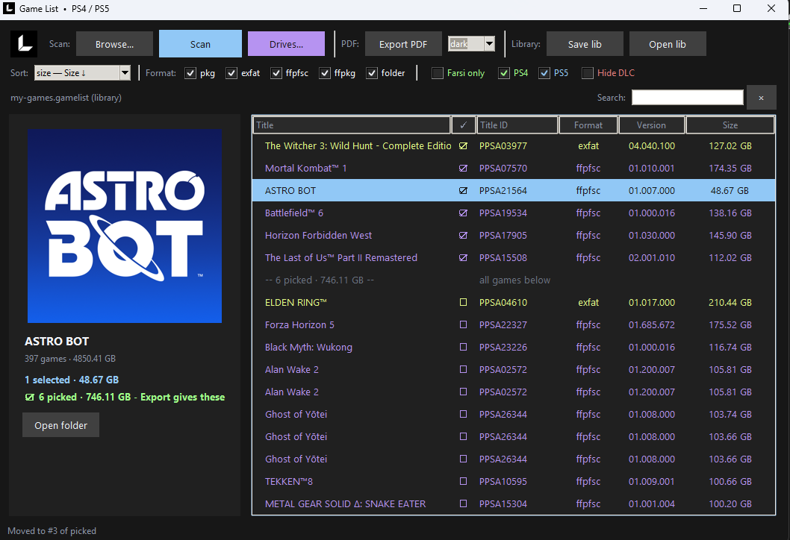
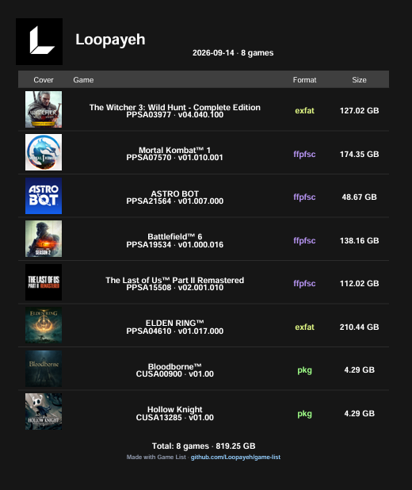

# Game List — PS4 / PS5

> # 🚧 Coming Soon 🚧
> First release is on the way — stay tuned.



**Game List** is for browsing your game archive: point it at a folder (or all drives at once) full of PS4 / PS5 game files and see your whole collection at a glance — cover art, title, Title ID, format, version, size. Pick titles, reorder them, and export the list as a PDF to share or print.



Works with `.pkg` packages, `.exfat` / `.ffpfsc` / `.ffpkg` images, and app folders. Parsing is powered by [PKG Viewer](https://github.com/Loopayeh/pkg-viewer).

## Features

- Fast scan with cache + parallel parsing (2 folder levels deep by default, up to 4)
- Scan one folder, or **All drives** at once (Windows drive skipped)
- Sort: size / title / newest added · filter by format, PS4 / PS5, Farsi subtitle, DLC
- Live search by title or Title ID
- Pick games with checkboxes (Space moves to next row, Ctrl+Z undoes) — picked games stay on top and survive any filter · `Select all` button (or click the ✓ header) picks every visible game for a full export
- Reorder picked games by dragging a row, or Alt+Up / Alt+Down — Export PDF follows your order, not the sort
- Live total: picked count + size, shown before export
- Customer PDF export (light / dark theme) with covers + total line
- Library snapshots (`.gamelist`): scan once at home, make PDFs at the shop with no HDD attached
- Open folder: reveal the selected game in Explorer (or double-click its row)
- Self-update: `Check updates` button compares with the latest GitHub release, downloads the new exe and restarts into it
- CLI mode for scripting

## Usage

Get `GameList.exe` from Releases — no Python needed, just run it. To run from source (needs Python 3 + Pillow + reportlab, plus [PKG Viewer](https://github.com/Loopayeh/pkg-viewer) next to it for the parser):

```bat
GameList.bat
```

CLI examples:

```bat
GameList.exe --scan D:\Games game-list.pdf
GameList.exe --scan ALL --depth=2 --theme=dark --console=ps5 list.pdf
GameList.exe --scan D:\Games --save-lib=my-games.gamelist
GameList.exe --scan . --lib=my-games.gamelist --hide-dlc shop-list.pdf
```

Write `Farsi` anywhere in a game's file/folder name and it gets an `FA subtitle` badge + its own filter.
